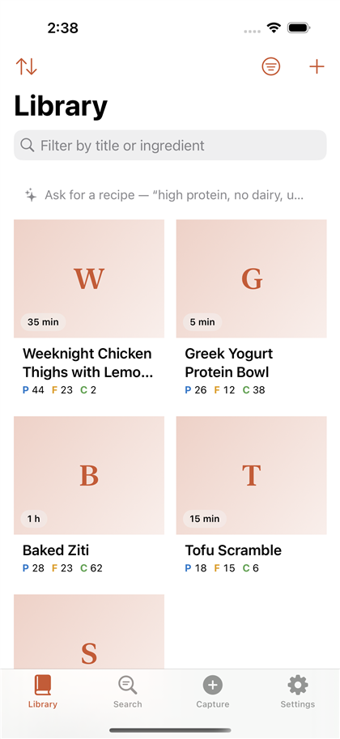
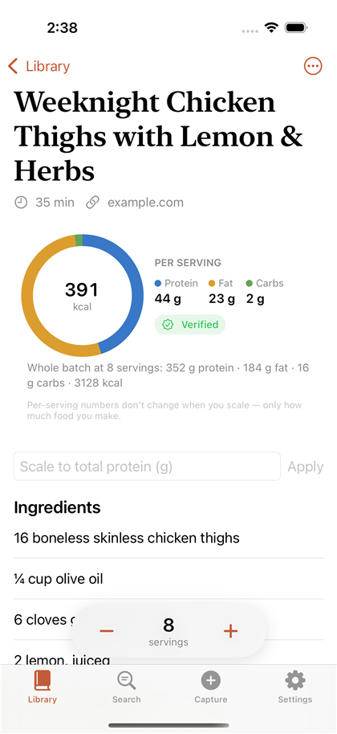
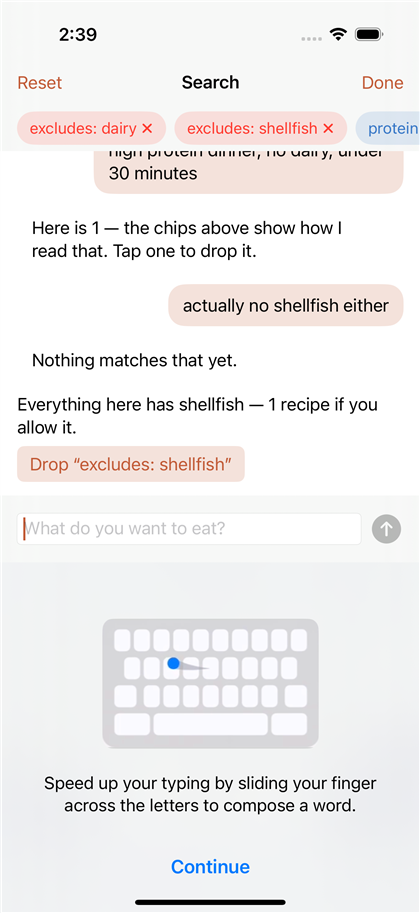
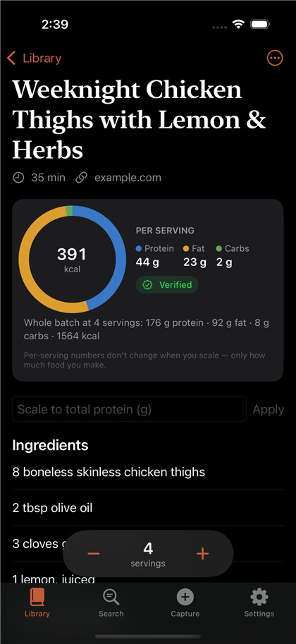

# Proportion

[](https://github.com/slateline/proportion/actions/workflows/ci.yml)


A macro-first recipe manager for iPhone. Capture a recipe from a photo, a
link, pasted text, or the share sheet; get structured ingredients and
macronutrients; scale it to any number of servings; and find what to cook by
describing it.

<p align="center">
  
  
  
  
</p>

## Features

- **Capture from anywhere** — photos and screenshots (on-device OCR), web links
  (schema.org recipe data when present), pasted text, and a Share Extension for
  Safari and social apps. Every import goes through a review screen before it
  is saved.
- **Exact scaling** — quantities are stored as rationals, so scaling never
  drifts. Units promote and demote as a cook expects (3 tsp → 1 tbsp,
  16 tbsp → 1 cup) and amounts round to kitchen-friendly fractions.
- **Macros first** — protein, fat and carbohydrate per serving on every card,
  with calories derived and a confidence label (verified, partly estimated,
  estimated). Nutrition comes from USDA FoodData Central.
- **Conversational search** — "high protein dinner, no dairy, under 30 minutes"
  becomes a set of editable filter chips. Follow-ups refine the search, and an
  empty result names the constraint that eliminated everything.
- **Dietary profile** — presets (vegetarian, gluten-free, nut-free, …) and
  custom exclusions that walk an ingredient taxonomy: "no dairy" catches
  parmesan, ghee and buttermilk; "no butter" does not catch peanut butter.
- **Private by design** — recipes live on the device and in the user's private
  iCloud database. Model-assisted parsing is optional, off without a key, and
  switchable in Settings.

## Getting started

Requires macOS with Xcode 16 or later.

```bash
brew install xcodegen
cd App
cp Config/Secrets.example.xcconfig Config/Secrets.xcconfig   # optional: add API keys
xcodegen generate
open Proportion.xcodeproj
```

Select your development team under Signing & Capabilities and run on a
simulator or device. The bundle identifiers, iCloud container and App Group
are defined in `App/project.yml`.

### Configuration

Both keys are optional. Without them the app uses its built-in deterministic
parsers and keyword search, and shows nutrition only when the source provides it.

| Key | Purpose | Where to get it |
|---|---|---|
| `ANTHROPIC_API_KEY` | Model-assisted recipe parsing, search interpretation, nutrition estimates | [console.anthropic.com](https://console.anthropic.com/settings/keys) |
| `USDA_API_KEY` | Nutrition lookup | [fdc.nal.usda.gov](https://fdc.nal.usda.gov/api-key-signup.html) |

Keys are read from `App/Config/Secrets.xcconfig`, which is git-ignored.

## Testing

The engine (`ProportionCore`) is a Foundation-only Swift package and runs
anywhere Swift does:

```bash
cd ProportionCore && swift test
```

Continuous integration runs the core tests on Linux and macOS, builds the app
and its extension, and drives the app through every screen in the simulator,
publishing screenshots and a recording as workflow artifacts. See
[docs/DEVELOPMENT.md](docs/DEVELOPMENT.md) for details, including running the
core tests on Windows.

## Project structure

```
ProportionCore/   Swift package: models, scaling, parsing, nutrition, search (170 tests)
App/              iOS app (SwiftUI + SwiftData), Share Extension, UI tests
docs/             Product spec, architecture notes, development guide
scripts/          Helper scripts
```

## Documentation

- [Product specification](docs/SPEC.md)
- [Architecture and design decisions](docs/ARCHITECTURE.md)
- [Development guide](docs/DEVELOPMENT.md) — CI, screenshot pipeline, Windows setup

## Status

All ten stages of the specification are implemented. The core is fully
tested; the app builds cleanly and passes its simulator walkthrough in CI. It
has not yet been run on a physical device, so the camera, sharing from a real
social app, and iCloud sync remain untested end to end.

Nutrition values shown by the app are approximate and are not medical advice.
